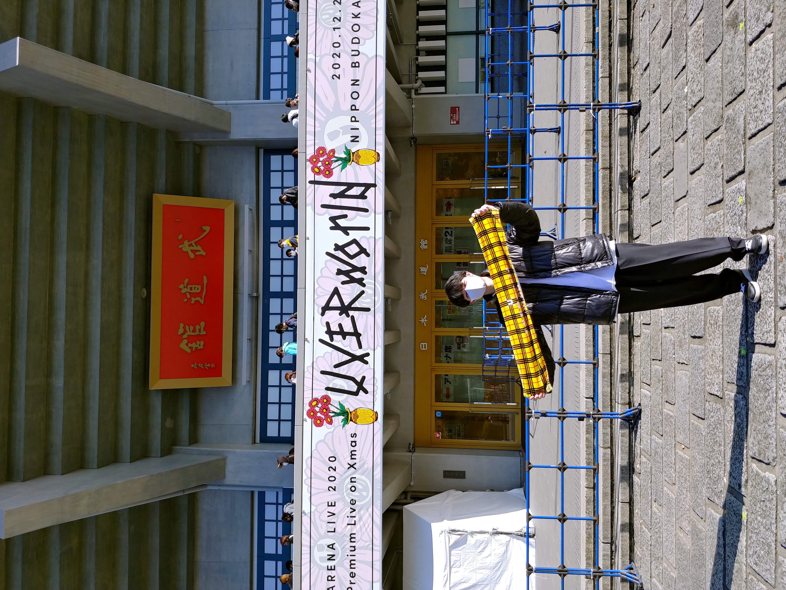

<iframe src="https://www.openprocessing.org/sketch/1093486/embed/" width="400" height="400"></iframe>

# About
大学一年です。中央大学iTLに通っています。

プログラミング言語はC言語とJavascriptを扱えます。

今後Unityなども勉強していきたいと思っています。

大学では法律についても学んでいます。特にやっているのは情報法分野です。

趣味でデザインや写真撮影、音楽活動等のクリエイティブな活動に取り組んでいます。　　

## Profile
- 名前:しーた
- 所在地:千葉市
- 得意領域:Webサービス開発
- 趣味:音楽（ドラム）、写真撮影

# Skills
使ったことや興味のある言語、ツール、OSなどを具体的に書きましょう。
- OS  windous,Ubuntu,Mac
- Language  Javascript,C言語
- Engine,Frameworks Node.js,Exprezss
- Tool,MiddleWare Git, PostgreSQL
- 資格、免許（情報処理技術者、LPICなど）

# Works
アピールできる活動内容を書きましょう。
- [GitHub]https://github.com/theata-prog
- 作った作品
  - [展示写（舎）](https://polar-earth-39625.herokuapp.com/)

# Contact
連絡先を書きましょう。
- [Twitter](https://twitter.com/home)

# History
学歴、職歴、アルバイト、インターン経験など。
- 2020年　中央大学国際情報学部入学

<a class="twitter-timeline" data-lang="ja" data-height="600" href="https://twitter.com/itl_yto?ref_src=twsrc%5Etfw">Tweets by itl_yto</a> 
